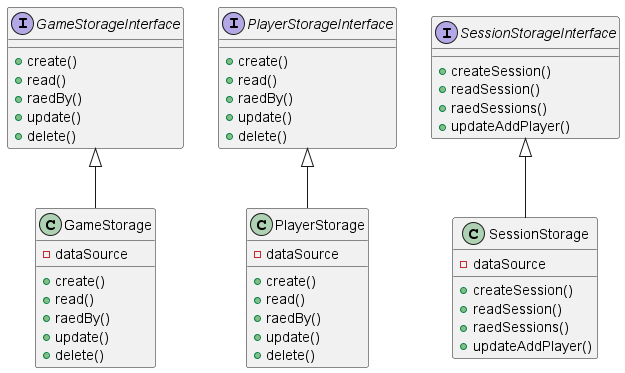
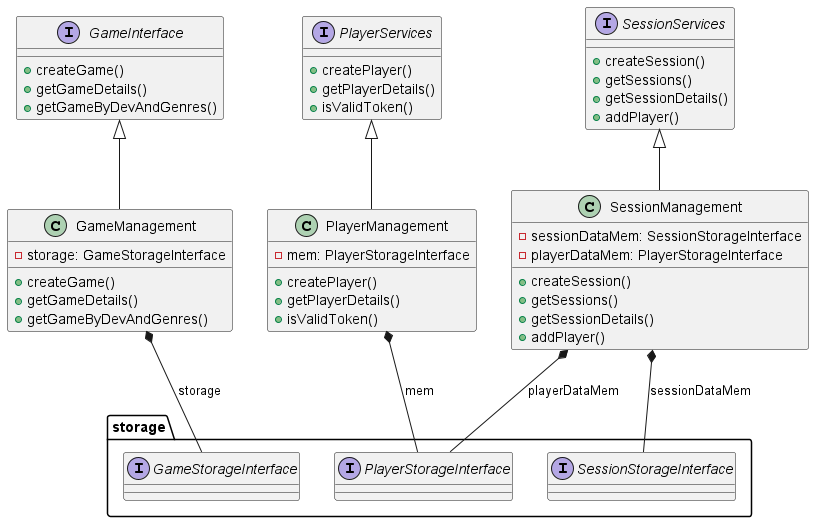

# Introduction

---

This project was developed for the Software Laboratory course. 
  
The main goal of this project is to develop an application that allows the user to 
manage sessions of a game and the players that will join this session.
  
The application should allow the user to:
- create: Players, Games and Sessions.
- read: Players, Games and Sessions.
- Update: Sessions.
 
The application should also allow the user to filter the Games and Sessions
by their properties like gid, sid, genre, developer, etc.

---

# Modeling the database

---

## Conceptual Model

The following diagram holds the Entity-Relationship model for the information managed by the system.

---

### DomainDiagram:


---

### StorageDiagram:



---

### ServicesDiagram:



---

### WebApiDiagram:


---

### We highlight the following aspects:
- The domain classes are made with Data classes.
- The domain classes are immutable.
- The domain classes have a constructor that receives all the properties.
- Besides the domain classes, all the other classes implement interfaces.
- The interfaces implement the methods that are necessary for each application module,
making a contract for the classes that implement them.

---

### The conceptual model has the following restrictions:
- An email is unique for each player.
And should follow a specific pattern. 
- A game has a unique identifier (gid) and a name.
- A session has a unique identifier (sid) and a date.
- A player has a unique identifier (pid) and a name.

---

## Physical Model

The physical model of the database is available in [SQL script](../../../../../sql/createSchema.sql).

---

### We highlight the following aspects of this model:
- The database is implemented in PostGreSQL.
- The database has three main tables: Players, Games and Sessions.
- The restriction of unique email, unique pid, gid and sid are implemented in the database.

---

# Software organization

---
## Open-API Specification
- [YAML file](SessionAppApi.yml)
---
### In our Open-API specification, we highlight the following aspects:

- The API should be able to create, read, players, games and sessions.
- The API should be able to update a session.
- The API should be able to filter games and sessions by their properties.
- To make any read or update request through the API, the user should provide the token.

---

## Request Details

---
### Request Processing

#### 1. Client Request
- A client initiates a request by sending an HTTP request to the server, containing relevant headers,
parameters, and possibly a request body.

#### 2. Routing
- The server's routing system intercepts the incoming request and directs it to the appropriate endpoint
based on the URL path and HTTP method.

#### 3. Handler Initialization
- Upon routing, the appropriate handler for the endpoint is initialized. 
Handlers encapsulate the logic for processing specific types of requests related to players, 
games, or sessions.

#### 4. Authentication and Authorization
- Before processing the request, the system authenticates and authorizes
the user's access to the requested resource. This step ensures that only
authorized users can perform certain actions.

#### 5. Request Parsing and Validation
- Request parameters are parsed and extracted from the request object.
After that, they are validated to ensure they adhere to defined criteria 
and the objective of the requested application.

#### 6. Response Generation
- Based on the outcome of program execution, an appropriate response is
generated. Responses include an HTTP status code, response headers, and
possibly a response body containing data or error messages.

---

### Internal Components for Request Handling

#### 1. RoutingHttpHandler
- This function constructs the routing HTTP handler for the 
application services.

1. It initializes storage and service elements and handlers necessary 
   for request processing.
2. The function returns the routing handler configured with appropriate endpoints and handlers

#### 2. Handler Classes and its Corresponding Interfaces
- Handler classes (PlayerHandler, GameHandler, and SessionHandler)
are responsible for processing requests related to players, games, 
and sessions, respectively.
- These classes implement interfaces defining the contract for request handling.
- Methods within those classes perform specific actions based on the received request.

#### 3. Other Request/Response Processing Functions

- readBody
  - Read the body of a request and return it as a map.
- unauthorizedAccess
  - Verifies if the request has a valid token.
- tryResponse
  - Creates a response with a given status and message, and if 
    an exception occurs, the response will have the given status and message.
- makeResponse
  - Creates a response with a given status and message.

---

### Request Parameter Validation

#### Where are the Requests Validated?
- They are validated in every handler class made 
(PlayerHandler, GameHandler and SessionHandler).

#### How are the Requests Validated?
- In every method of all the handler classes, the parameters 
necessary are extracted from the query or the body of the request.
- After that, there are verifications to conclude if all the necessary
parameters were passed correctly. If that's not the case, a response with
the status *Bad Request* is sent to the client.


## Connection Management and Transaction Scopes

### 1. Connection Between Client and Server
- The client initiates communication by sending an HTTP request to the server.
- The server listens for incoming requests on a specified port and establishes
a connection upon receiving a request.
- In this application, we use the library [http4k](https://www.http4k.org/) to make the connection between
Client and Server possible.

### 2. Connection Between Server and Database 
#### Connection Establishment:
- The storage classes initialize a *PGSimpleDataSource*, which represents
the PostgresSQL data source used for database connections.
- The data source is configured with the database URL obtained from the environment
variable specified during initialization.

#### Transaction Scopes:
- Using the *executeCommand* extension function defined for the *Connection*
class on every method of the storage modules, it's possible to execute SQL 
queries safely. 
- This happens because the executeCommand function disables auto-commit mode 
on the connection, allowing multiple SQL statements to be executed as part of 
the same transaction scope.
- If an exception occurs during command execution, the connection is rolled back 
to its previous state, ensuring that any changes made within the transaction are 
undone. 
- Upon successful execution of the command, the transaction is committed, 
persisting the changes made within the transaction to the database.

---

## Data Access

The data access is handled in the storage the executeCommand function disables auto-commit mode on the connection, allowing multiple SQL statements to be executed as part of the same transaction scope.
If an exception occurs during command execution, the connection is rolled back to its previous state, ensuring that any changes made within the transaction are undone.
Upon successful execution of the command, the transaction is committed, persisting the changes made within the transaction to the database module, using a connection to make any query or update.

### the main SQL statements used are:

---
- to create a game:
```sql
INSERT INTO GAME(name, developer) VALUES (?, ?);
INSERT INTO GENRE(name) VALUES (?) ON CONFLICT DO NOTHING;
INSERT INTO GAME_GENRE(gid, genre) VALUES (?, ?)
```
---
- to read a game:
```sql
SELECT gid, name, developer FROM GAME WHERE gid = ?;
SELECT name FROM GENRE JOIN GAME_GENRE ON GENRE.name = GAME_GENRE.genre WHERE GAME_GENRE.gid = ?
```
---
- to read a game by genre or dev:
```sql
SELECT name FROM GENRE JOIN GAME_GENRE ON GENRE.name = GAME_GENRE.genre WHERE GAME_GENRE.gid = ?;
SELECT name FROM GENRE JOIN GAME_GENRE ON GENRE.name = GAME_GENRE.genre 
WHERE GAME_GENRE.gid = ? AND GAME_GENRE.genre = ?
```
---
- to create a player:
```sql
INSERT INTO PLAYER (name, email, token) VALUES (?, ?, ?)
```
---
- to read a player:
```sql
SELECT pid, name, email, token FROM PLAYER WHERE pid = ?
```
---
- to read a player by email or token:
```sql
SELECT pid, name, email, token FROM PLAYER WHERE email = ? OR token = ? OFFSET ? LIMIT ?
```
---
- to create a session:
```sql
INSERT INTO SESSION (capacity, gid, date) VALUES (?,?,?);
INSERT INTO PLAYER_SESSION (pid, sid) VALUES (?,?)
```
---
- to read a session:
```sql
SELECT sid, capacity, gid, date FROM SESSION WHERE sid = ?;
```
---
- to read a session by dev, date, playerId or state:
```sql
SELECT s.sid, s.capacity, s.gid, s.date
  FROM session s
    LEFT JOIN player_session ps ON ps.sid = s.sid
  WHERE (s.gid = ?)
  OR (s.date = ?)
  OR (ps.pid = ?)
  GROUP BY s.sid, s.capacity, s.gid, s.date
  HAVING (? = 'null') OR
  (? = 'OPEN' AND s.capacity > count(ps.pid)) OR
  (? = 'CLOSE' AND s.capacity = count(ps.pid))
  OFFSET ? LIMIT ?;
```
---
- to update a session:
```sql
INSERT INTO PLAYER_SESSION (pid, sid)
  SELECT ?, ?
  WHERE NOT EXISTS (SELECT 1 FROM PLAYER_SESSION WHERE pid = ? AND sid = ?);
```
---

## Error Handling

The errors are handled in the services module, where the exceptions are caught,
and a response with ServicesError is sent to the webApi handler.

the error caught are:
- IllegalArgumentException
- IllegalStateException
- NoSuchElementException
- SQLException

---

# Critical Evaluation

## Not concluded functionalities and defects
- the lack of possibility to update a player. (can be used to update the token).
- the lack of possibility to delete a player, game or session.
- the possibility to filter the players using its email.

## Improvements to be made:
- Implement the possibility to update a player.
- Implement the possibility to delete a player, game or session.
- Implement the possibility to filter the players using its email.
- Implement a graphical interface to make the application more user-friendly.